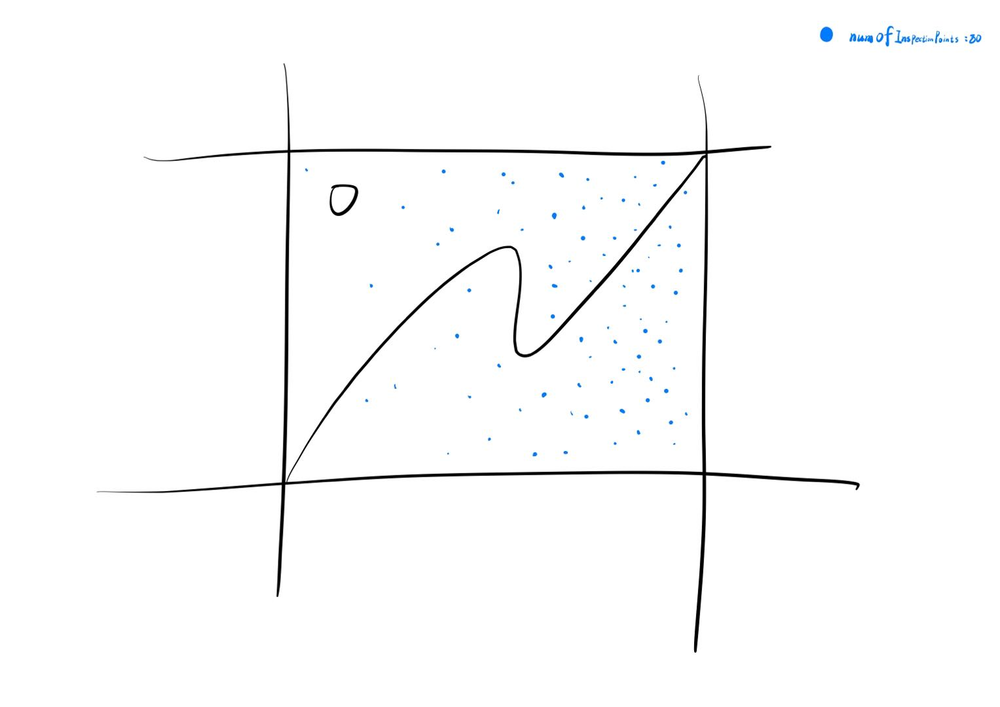
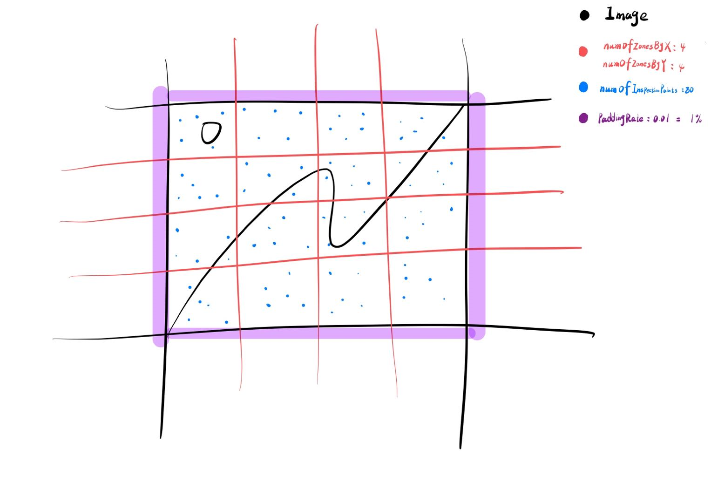
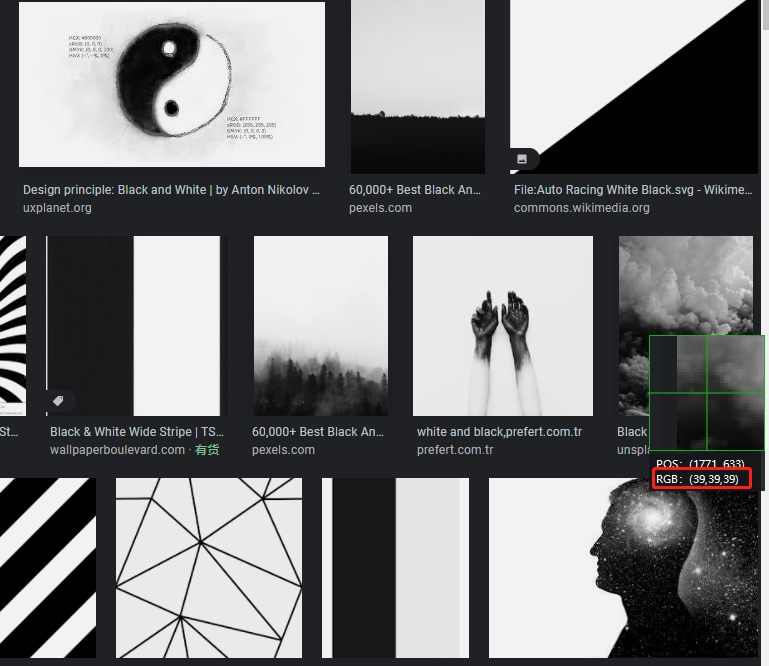

# `detect-image-grayscale-percentage`

[](https://github.com/YingJiangHui/js-utility-libs/tree/main/LICENSE)
[](https://badge.fury.io/js/detect-image-grayscale-percentage)

[//]: # ([![CircleCI]&#40;https://circleci.com/gh/YingJiangHui/neat-ui-react/tree/dev.svg?style=svg&#41;]&#40;https://circleci.com/gh/YingJiangHui/neat-ui-react/tree/dev&#41;)

> This library provides one API.Used to detect grayscale percentage for picture.You can use it judgment white and black image.

## Usage

### Install
```bash
pnpm add detect-image-grayscale-percentage
yarn add detect-image-grayscale-percentage
npm add detect-image-grayscale-percentage
```

### Usage
```TS
import  detectImageGrayscalePercentage from detect-image-grayscale-percentage;

const image = new Image

image.onload = ()=>{
    image.src = "host/../path/image.jpg"
    const grayscalePercentage = await detectImageGrayscalePercentage(Image)
    if(grayscalePercentage===1){
        // image is white and black picture
        // do something...
    }

}
```

Second parameter type: GrayscaleStandardConfig
```TS
// include default value
class GrayscaleStandardConfig {
  numOfInspectionPoints = 1000; // How many points to detect
  diff = 5; // rgb value among maximum of difference 
  
  // The following values are mainly used for optimization
  
  // Mainly for random get detecting points more average,The following values will partition to 10 * 10 equal to 100 zones
  numOfZonesByX = 10;
  numOfZonesByY = 10;
  
  // "paddingRate" base on height and width,that part will not detecting
  paddingRate?: number //default:0  valable: 0-1
}
```
You can adjust the parameters util the appropriate your scene.
```TS
detectImageGrayscalePercentage(Image,{
    numOfInspectionPoints:10000
    diff: 50
})
```

When no partition spaces,might like this.


When partition spaces after,may like this.



How to work?

White-and-black picture of RGB values very close

